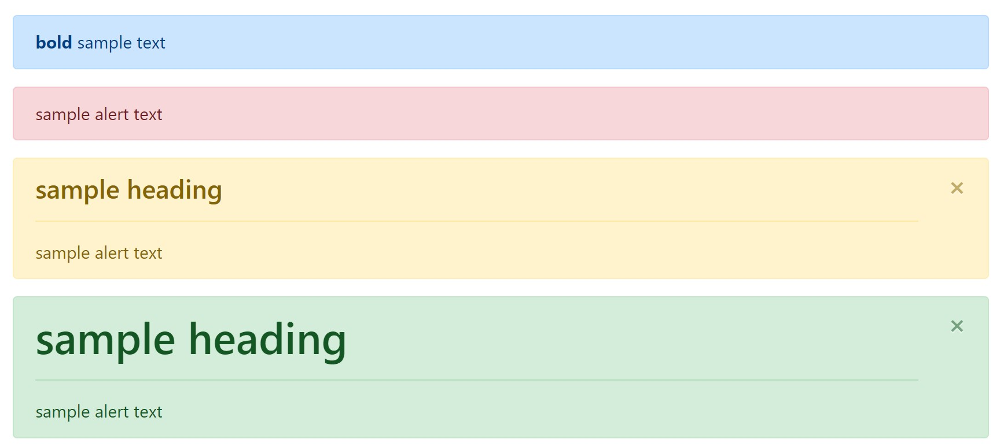

# Alerts

It is important to reference the bootstrap documentation for how alerts work.
This is how to include alerts in your code

### Examples
Add any one of the  the following in your code, to show an alert

```
    
    
    
    
```
#### Which look like this: 



### Arguments 

* **Required: content**      
    - the content of the alert. Keep in mind that this string can be html for additional formatting
    - _string_ 
* **Required: color** 
    - accepts bootstrap colors like: primary, success, danger, etc. 
    - _string_ 
* **heading** 
    - creates a `<h4>` heading by default in the alert
    - _string_ 
* **heading_size** 
    - overrides `<h4>` default, allows 1-6
    - _int_ 
* **dismiss** 
    - allows alert to be dismissible, requires bootstrap js
    - _bool (Enter 'True' or 1)_
