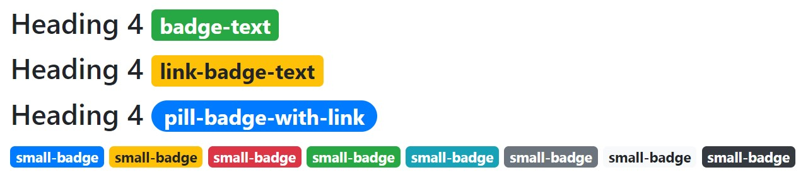

# Badges

It is important to reference the bootstrap documentation for how alerts work.
This is how to include badges in your code

### Examples
Add any one of the  the following in your code, to show an alert

```
<h4>Heading 4  </h4>
<h4>Heading 4  </h4>
<h4>Heading 4  </h4>
```

for reference:
```








```
#### Which look like this: 



### Arguments 

* **Required: content**
    - adds text in the middle of the badge
    - string

* **color** 
    - default: 'primary' 
    - accepts bootstrap colors like: primary, success, danger, etc. 
    - _string_ 
* **pill**
    - accepts 'True' or 1; allows for more rounded borders 
    - bool
* **href**
    - allows the badge to be a link, enable hover and actionable properties 
    - accepts href property
    - string

