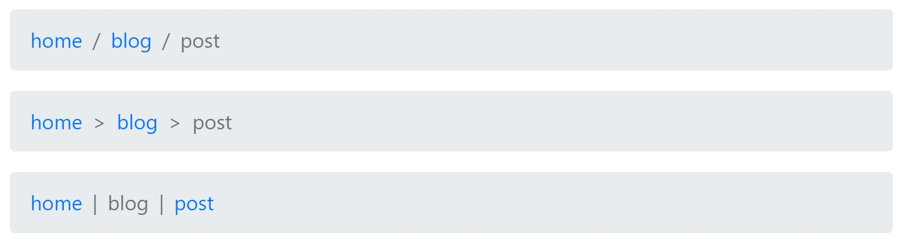

# Breadcrumbs

It is important to refrence the bootstrap documentation for how alerts work.
This is how to include breadcrumbs in your code

#### Note: This component requires you to send data to the template from context 

### Examples
Add any one of the  the following in your code, to show an alert

```
    
    
    
```

Here is an example of what the crumbs context should look like: 
```
CRUMBS = (('home', reverse('index')),
          ('blog', reverse('blog:posts')),
          ('post', reverse('blog:post', args=[post_id]))
        )
```

#### Which look like this: 



### Arguments 

* **Required: content**
    - adds text in the middle of the badge
    - string

* **seperator**
    - Changes the separator between elements; default: `/`
    - accepts any normal character and the following symbols:
        * `<, >, |`
    - string

* **Required: crumbs**
    - Accepts a tuple or list from context that has the structure `[(<breadcrumb-text>, <breadcrumb-link>), ...]`
    - tuple or list

* **active_crumb**
    - Enter the index number starting from zero of which breadcrumb is active, by default it is the last one
    - int
