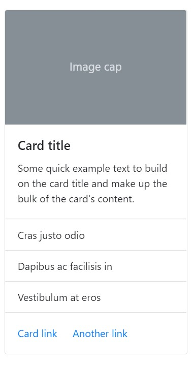

# Cards

It is important to reference the bootstrap documentation for how alerts work.
This is how to include cards in your code

###### Alert: This component may require you to send data to the template from context 

#### Description
Cards in bootstrap are highly customizable and very extensible. Thus, we do not support all the 
different variations of a card, rather a 'one-size-fits-all' template. If this is not what works for you 
we recommend manually adding cards. 

The included elements in the card are, in order from top to bottom: an image, a header with a title and a subtitle, some text, a list-group, a footer with two buttons. Like the following: 



Obviously, you need not enable each element, pick and choose what you want. 

#### Use Case
To understand why we have done things a certain way understanding the expected use case may help. 
We expect that cards will generally be looped over to show a collection of content like on a storefront displaying its products. 
Take a look at [bootstrap card layout documentation](https://getbootstrap.com/docs/4.5/components/card/#card-layout) to get a better idea on how to display your cards. 


### Examples
Add any one of the  the following in your code, to show an alert

```


```

#### Which look like this: 


### Arguments 

* **image_src**
    - Accepts a string of the image url, if you want to add a static image use a context manager in your template to do so. i.e. `   `

* **title** 
    - Required
    - Accepts a string (can use html like `<strong>` )
    - string

* **subtitle**
    - Accepts a string (can use html like `<strong>` )
    - string

* **text**
    - Short text that appears after the title 
    - string

* **list_group**
    - accepts a list of objects from the view
    - Requires the following fields: list_group_display_field
    - list or iterable like QuerySet

* **list_group_display_field**
    - the field of the object that is iterated on passed in list_group
    - string

* **button1_text**
    - text for the first button in the footer
    - string

* **button2_text**
    - text for the second button in the footer
    - string

* **button1_url**
    - link for the first button, use of reverse recommended if linking to page on site
    - string

* **button2_url**
    - link for the second button, use of reverse recommended if linking to page on site
    - string

* **background**
    - accepts colors like primary, secondary, success, transparent, etc. 
    - string

* **border**
    - accepts colors like primary, secondary, success, transparent, etc. 
    - string

* **color**
    - accepts colors like primary, secondary, success, transparent, etc. 
    - string

* **size_utilities**
    - use w-50, or h-100, or other utilities for sizing
    - string
